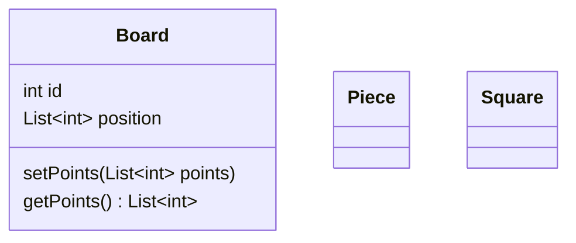
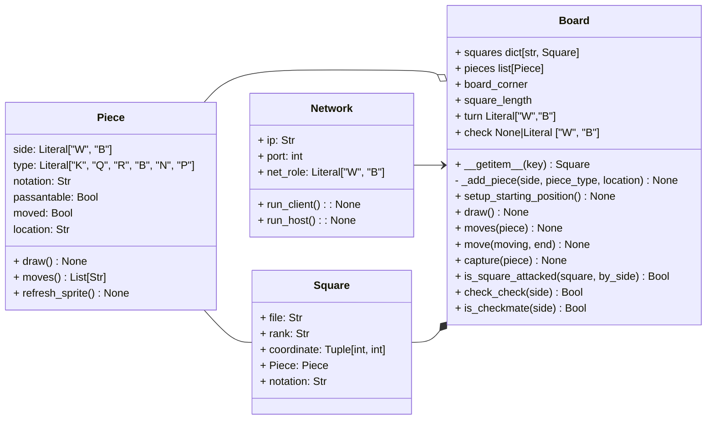

```mermaid.js
classDiagram
class Board{
            int id
            List~int~ position
            setPoints(List~int~ points)
            getPoints() List~int~
        }
        
        Board  
        Board  
        Board  
class Piece{
			
		}
class Square
 

```

```mermaid
classDiagram
	direction RL
    class Board {
        + \_\_getitem__(key) Square 
        - \_add_piece(side, piece_type, location) None
    
        + setup_starting_position() None
        + draw() None
        + moves(piece) None
        + move(moving, end) None
        + capture(piece) None
        + is_square_attacked(square, by_side) Bool
        + check_check(side) Bool
        + is_checkmate(side) Bool
    
        + squares dict[str, Square]
        + pieces list[Piece]
        + board_corner
        + square_length 
        + turn Literal["W","B"]
        + check None|Literal ["W", "B"]
        }

    class Piece {
		side: Literal["W", "B"]
		type: Literal["K", "Q", "R", "B", "N", "P"]
		notation: Str
		passantable: Bool
		moved: Bool
		location: Str
        + draw() None
        + moves() List[Str]
        + refresh_sprite() None
    }

    class Square {
        + file: Str
        + rank: Str
        + coordinate: Tuple[int, int]
        + Piece: Piece
        + notation: Str
    }
    
    class Network {
	    + ip: Str
	    + port: int
	    + net_role: Literal["W", "B"]
    
	    + run_client(): None
	    + run_host(): None
    }
Board *-- Square
Board o-- Piece 
Board <-- Network
Square -- Piece
```

