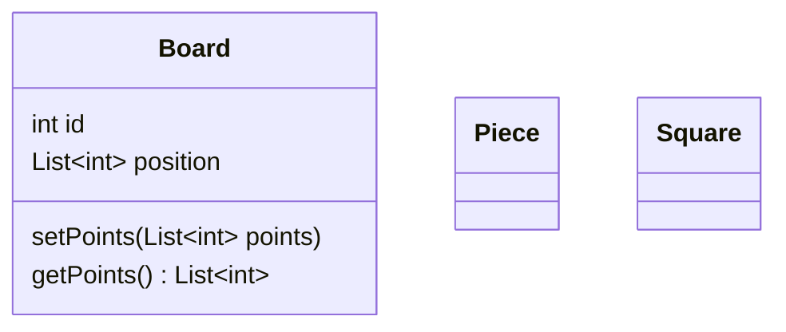
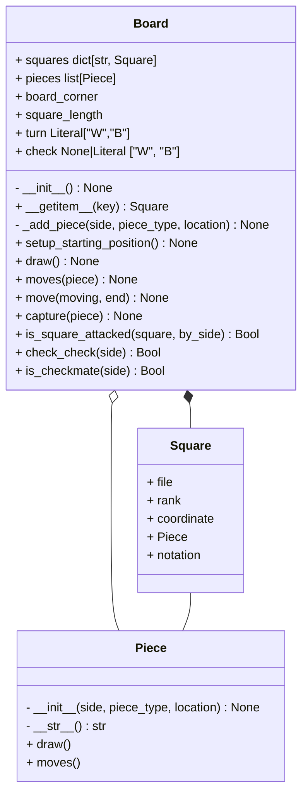

```mermaid.js
classDiagram
class Board{
            int id
            List~int~ position
            setPoints(List~int~ points)
            getPoints() List~int~
        }
        
        Board  
        Board  
        Board  
class Piece{
			
		}
class Square
 

```

```mermaid
classDiagram
    class Board {
        - \_\_init__() None
        + \_\_getitem__(key) Square 
        - \_add_piece(side, piece_type, location) None
    
        + setup_starting_position() None
        + draw() None
        + moves(piece) None
        + move(moving, end) None
        + capture(piece) None
        + is_square_attacked(square, by_side) Bool
        + check_check(side) Bool
        + is_checkmate(side) Bool
    
        + squares dict[str, Square]
        + pieces list[Piece]
        + board_corner
        + square_length 
        + turn Literal["W","B"]
        + check None|Literal ["W", "B"]
        }

    class Piece {
        - \_\_init__(side, piece_type, location) None
        - \_\_str__() str
        + draw()
        + moves()
    }

    class Square {
        + file
        + rank
        + coordinate 
        + Piece
        + notation
    }
Board *-- Square
Board o-- Piece 
Square -- Piece
```
