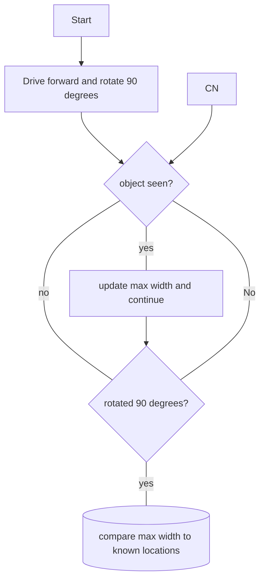

```mermaid.js

flowchart TD
Start --> A 
A[Drive forward and rotate 90 degrees]
A --> B
B{object seen?}
B -- no --- C
B -- yes --- BC[update max width and continue]
BC --> C
C{rotated 90 degrees?} -- No --- B
CN --> B
C -- yes --- D[(compare max width to known locations)]


```
